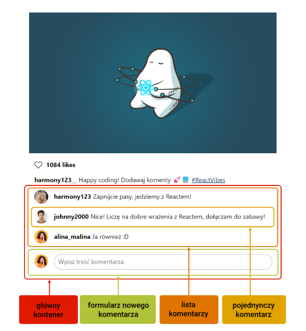

Spróbujmy przyjrzeć się projektowi naszej sekcji z komentarzami.



Z tej ilustracji wynika, że potrzebujemy czterech <a href="/glossary/komponent/" target="_blank">komponentów React</a>.

```js
src/
|-- components/
|   |-- AddComponentForm.js // formularz dodania nowego komentarza
|   |-- Comments.js // pojedynczy komentarze
|   |-- CommentList.js // lista komentarzy
|   |-- CommentSection.js // kontener dla wszystkich pozostałych komponentów
```
