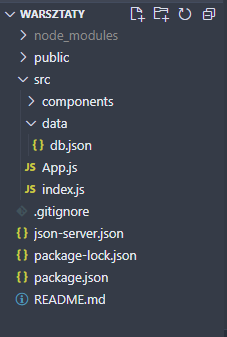

Dzisiaj zrobimy **Mini Instagrama** za pomocą języka JavaScript oraz biblioteki React.\
Struktura i wygląd (HTML i CSS) są już gotowe.\
Naszym zadaniem będzie ożywić go dodając kod JavaScript.

## Środowisko pracy

- przeglądarka internetowa - polecamy Chrome
- narzędzia programisty - bez nich ani rusz! Naciśnij F12 (Ctrl + Option + I na Macbookach), żeby je otworzyć.
- edytor kodu - polecamy Visual Studio Code
- Node.js - środowisko do uruchamiania aplikacji `npm i node@18.19.1`

## Instalacja projektu

- otwórz projekt w programie VSC i otwórz terminal (na górnym menu na opcja "Terminal" lub `Ctrl + Shift + ù` / `Cmd + Shift + ``\`)
- w terminalu wpisz polecenie `npm install` a następnie `npm install -g json-server`
- odpal serwer za pomocą polecania `json-server --watch src/data/db.json --port 3001`
- odpal projekt za pomoca polecania `npm run start`

## Struktura projektu

1. `node_modules` to katalog w projekcie Node.js, który zawiera wszystkie zewnętrzne zależności (biblioteki, paczki) wykorzystywane przez dany projekt. Gdy instalujesz paczki za pomocą menedżera pakietów npm (Node Package Manager) lub Yarn, są one pobierane i przechowywane w katalogu node_modules.
2. `public` - katalog zawierający główny plik HTML, CSS oraz grafiki używane w projekcie
3. `src` - katalog zawierający folder z komponentami React, danymi oraz plik `index.js`, który jest głównym plikiem startowym aplikacji, gdzie renderuje się główny komponent App do drzewa DOM, uruchamiając aplikację React. Plik `App.js` zawiera główny komponent App, który jest głównym komponentem aplikacji. To tutaj definiujesz strukturę i układ głównego interfejsu użytkownika aplikacji. 
4. pliki konfiguracyjne `package.json`, `package-lock.json`

## DevTools - narzędzia programisty

DevTools w Chrome to zestaw narzędzi deweloperskich wbudowanych w przeglądarkę Google Chrome. Pozwala on na debugowanie, profilowanie wydajności, analizowanie struktury strony, edycję stylów CSS, testowanie interakcji z DOM-em i wiele innych rzeczy. 

### Otwieranie DevTools

1. Przez menu przeglądarki: kliknij prawym przyciskiem myszy na stronie internetowej, a następnie wybierz "Zbadaj" lub "Zbadaj element".
2. Skrótem klawiaturowym: w systemie Windows i Linux: `Ctrl + Shift + I`, w systemie macOS: `Cmd + Option + I`.
3. Poprzez użycie klawisza funkcyjnego `F12`

### Główne zakładki DevTools

- Elements (Elementy): Pozwala na inspekcję i edycję struktury DOM oraz stylów CSS strony internetowej.
- Console (Konsola): Pozwala na wyświetlanie błędów, debugowanie JavaScript i wykonywanie poleceń JavaScript na żywo.
- Sources (Źródła): Umożliwia debugowanie kodu JavaScript oraz zarządzanie plikami źródłowymi.
- Network (Sieć): Pozwala na monitorowanie żądań sieciowych, czasu ładowania zasobów i analizę wydajności stron internetowych
